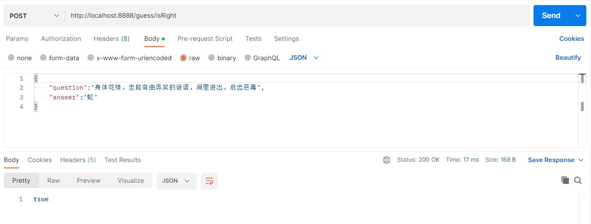

### 接口说明

#### 获取问题接口

所需参数为 id（1-20），在url种传入id即可获取问题

路径：/guess/question/{id}

请求方式：Get

#### 获取答案接口

所需请求体参数为  Guess类，只需在Guess类写入question数值即可，请求体示例如下

路径：/guess/answer

请求方式：Post

#### 判断对错接口

所需请求体参数为  Guess类，只需在Guess类写入question数值与所输入答案answer即可，请求体示例如下

路径：/guess/isRight

请求方式：Post